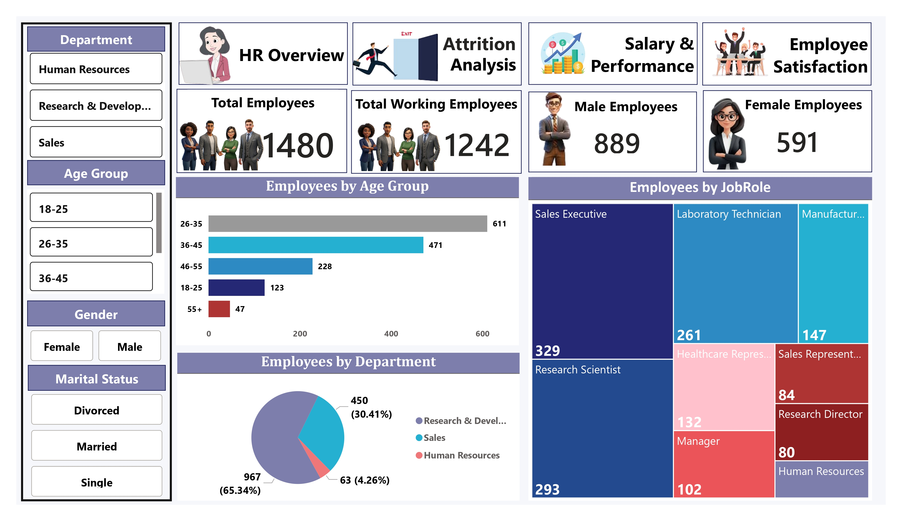
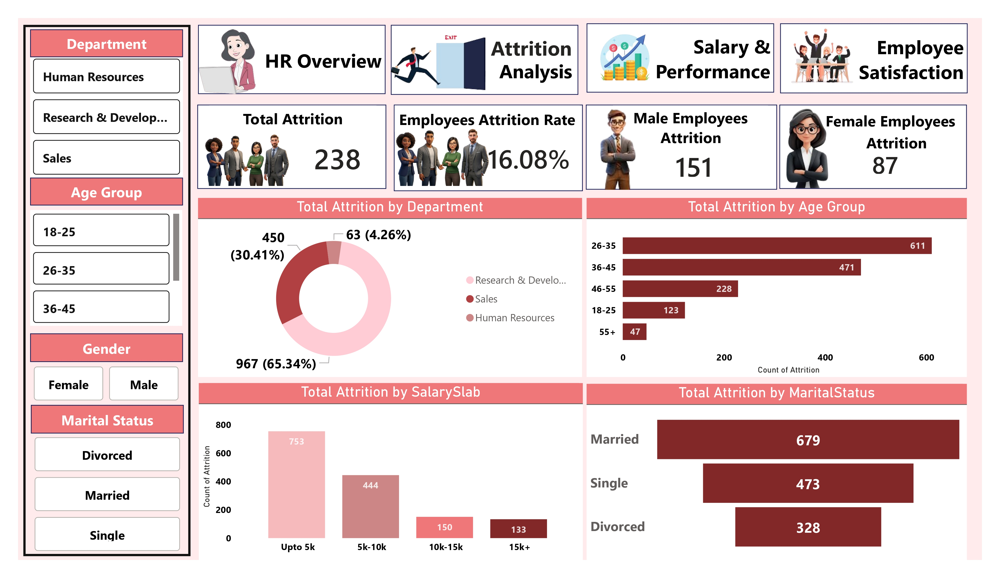
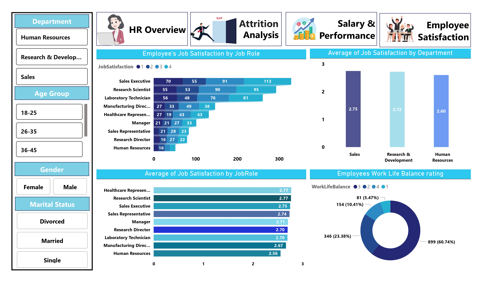
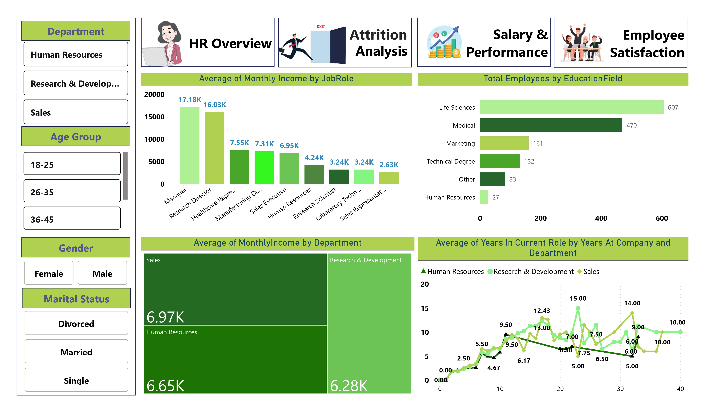

# HR Analytics Dashboard

## Project Overview
Interactive HR Analytics Dashboard developed in Power BI to analyze workforce demographics, attrition trends, employee satisfaction, and salary performance.

## Key Insights
- Total Employees: 1480
- Attrition Rate: 16.08%
- Department-wise Analysis
- Employee Satisfaction Analysis
- Salary & Performance Analysis

## Tools Used
- Power BI
- DAX
- Power Query
- Excel

## Dashboard Pages
1. HR Overview
2. Attrition Analysis
3. Salary & Performance
4. Employee Satisfaction

## Files Included
- HR_Analytics.pbix
- Dashboard PDF
- Dataset

# HR Analytics Dashboard

## Dashboard Preview

